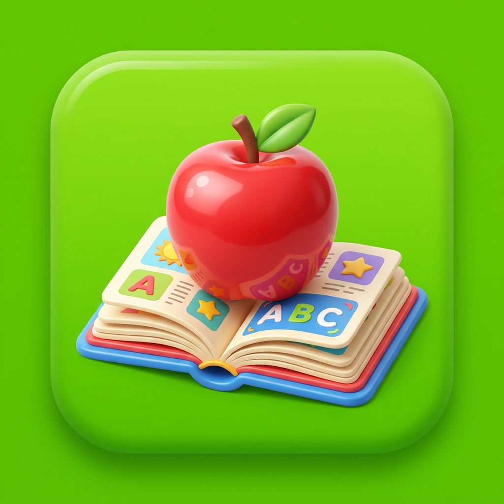

# EngFun - Học Tiếng Anh 4 (Global Success) 🍎📖

**EngFun** là một ứng dụng Web học từ vựng tiếng Anh được thiết kế đặc biệt dành cho học sinh Lớp 4 (theo bộ sách Global Success). Ứng dụng mang phong cách "Gamification" (Game hóa) lấy cảm hứng từ Duolingo, giúp biến việc học từ vựng khô khan thành một trò chơi đầy màu sắc và thú vị.



## 🌟 Tính Năng Nổi Bật

- **Bản Đồ Lộ Trình (Roadmap):** Học sinh đi qua từng "Trạm" bài học trên một bản đồ sinh động. Các trạm được mở khóa dần dần khi hoàn thành bài cũ.
- **Minigames Đa Dạng:**
  - **Lật thẻ (Flashcard):** Làm quen từ vựng mới với hình thức lật mặt trước/sau để xem nghĩa và nghe phát âm.
  - **Trắc nghiệm (Quiz):** Chọn nghĩa tiếng Việt, hoặc nghe phát âm để chọn nghĩa.
  - **Nối từ (Match Pairs):** Game tìm cặp từ vựng Tiếng Anh - Tiếng Việt tương ứng trên một lưới 8 thẻ.
  - **Xếp chữ (Spelling Bee):** Thử thách tại Trạm Boss, yêu cầu học sinh ghép các chữ cái rời rạc thành một từ hoàn chỉnh.
- **Hệ Thống Trái Tim (Lives) & Phạt:** Bắt đầu với 3 trái tim ❤️. Mỗi lần làm sai sẽ bị trừ tim, màn hình rung lắc báo lỗi. Nếu hết tim, học sinh phải chơi lại từ đầu bài học.
- **Trạm Cứu Thương Ký Ức (Spaced Repetition):** Ứng dụng âm thầm ghi nhớ các từ vựng học sinh hay làm sai. Khi số từ sai đạt giới hạn, một "Trạm Cứu Thương" sẽ xuất hiện trên bản đồ để bắt buộc học sinh ôn tập lại.
- **Chế Độ Chép Từ Vựng (Copy Phase):** Ở lần đầu tiên vào bài, sau khi lật Flashcard, học sinh sẽ có 15 phút đếm lùi để lấy vở ra chép từ. Đề cao tính giáo dục truyền thống kết hợp công nghệ.
- **Âm Thanh Điện Tử 8-bit:** Toàn bộ hiệu ứng âm thanh (Ting ting, Bóp bóp, Game Over) được lập trình sinh trực tiếp bằng `AudioContext` của trình duyệt, không cần tải bất kỳ file MP3 nào, giúp app cực kỳ nhẹ.
- **Hỗ trợ Ứng Dụng Độc Lập (PWA):** Có thể "Cài đặt" (Install) ứng dụng này lên điện thoại, máy tính bảng hoặc Desktop. Hỗ trợ Service Worker lưu trữ đệm (Cache) giúp ứng dụng tải siêu nhanh và có khả năng chạy không cần mạng (Offline).

## 🛠 Công Nghệ Sử Dụng

- **Frontend:** HTML5, CSS3 thuần (Vanilla), JavaScript thuần (ES6+). KHÔNG sử dụng framework (React, Vue, v.v.).
- **Lưu Trữ:** `IndexedDB` để lưu trữ vĩnh viễn tiến độ học tập (Số sao, Trái tim, Số chuỗi ngày, XP, Danh sách từ yếu).
- **PWA:** Gồm `manifest.json` và `sw.js` (Service Worker) để đáp ứng tiêu chuẩn ứng dụng Web có thể cài đặt.
- **Text-to-Speech:** Sử dụng API `window.speechSynthesis` tích hợp sẵn của trình duyệt để đọc từ vựng tiếng Anh.
- **Icon/Fonts:** Sử dụng FontAwesome cho biểu tượng và Google Font "Nunito" cho chữ viết dễ thương.

## 🚀 Cách Cài Đặt & Chạy

1. **Chạy trực tiếp:** Bạn chỉ cần mở file `index.html` bằng bất kỳ trình duyệt hiện đại nào (Chrome, Edge, Safari, Firefox).
2. **Chạy qua Local Server (Khuyến nghị để PWA hoạt động tốt nhất):**
   - Sử dụng Live Server extension trong VSCode, hoặc
   - Chạy lệnh Python: `python -m http.server 8000` tại thư mục dự án và truy cập `http://localhost:8000`.
3. **Cài đặt lên Điện thoại:**
   - Mở link dự án trên Chrome (Android) hoặc Safari (iOS).
   - Chọn "Add to Home Screen" (Thêm vào Màn hình chính) hoặc "Install App" (Cài đặt ứng dụng). App sẽ xuất hiện dưới dạng biểu tượng Quả Táo & Cuốn sách.

## 📂 Cấu Trúc Thư Mục

```text
/
├── index.html        # Giao diện chính của ứng dụng
├── manifest.json     # Cấu hình PWA (Tên app, màu sắc, chế độ màn hình)
├── sw.js             # Service Worker (Xử lý Cache và Offline mode)
├── vocab.txt         # Nguồn dữ liệu từ vựng thô
├── README.md         # File giới thiệu dự án
├── assets/
│   └── icon.png      # Biểu tượng của PWA (Hình quả táo và cuốn sách)
├── css/
│   └── style.css     # Style giao diện (Responsive, animations)
└── js/
    ├── app.js        # Logic chính (Điều hướng, vòng lặp game, DOM manipulation)
    ├── audio.js      # Synthesizer âm thanh 8-bit và Text-to-speech
    ├── data.js       # Phân tích dữ liệu từ vocab.txt và quản lý IndexedDB
    └── confetti.js   # Hiệu ứng pháo giấy khi hoàn thành bài học
```

---
*Dự án được xây dựng với mục tiêu mang lại niềm vui và động lực học Tiếng Anh cho trẻ em!*
